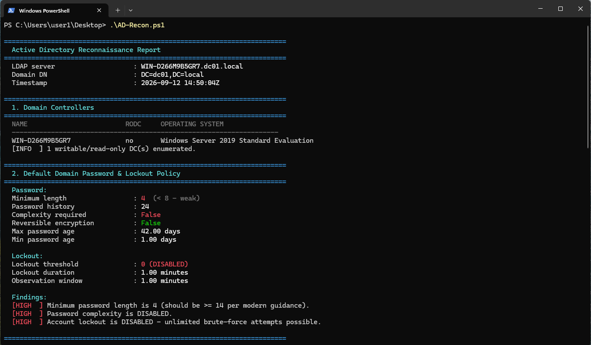
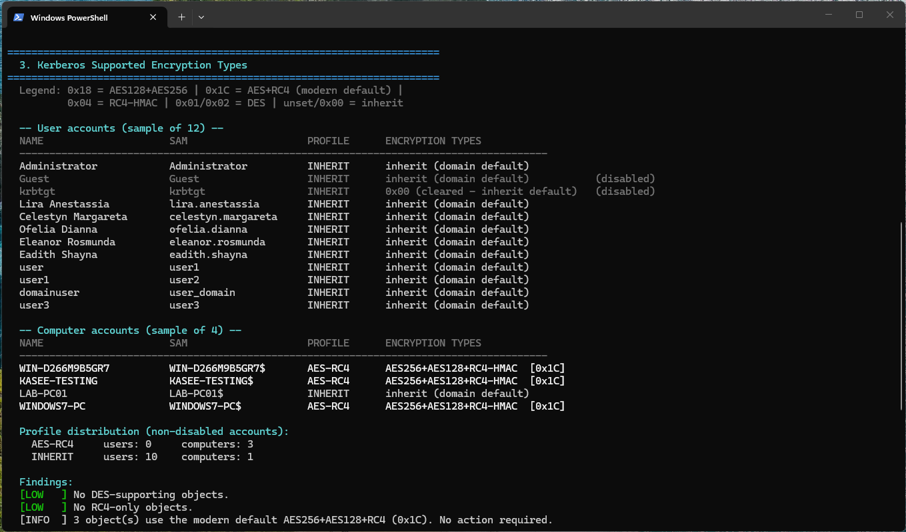
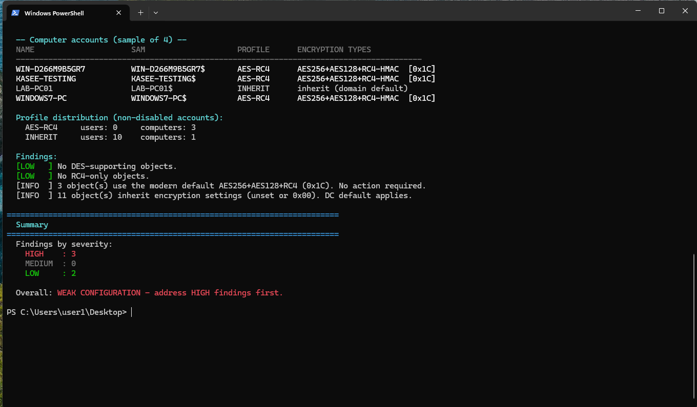

# Active Directory Recon

A lightweight, **read-only PowerShell tool** for auditing Active Directory environments through **LDAP**, without requiring the Active Directory PowerShell module or RSAT.

Designed for security assessments, internal audits, and Active Directory reconnaissance in authorized environments.

## Features

* Enumerates Domain Controllers and Read-Only Domain Controllers (RODCs)
* Reviews domain password and account lockout policies
* Analyzes Kerberos encryption configurations
* Identifies DES and RC4-only configurations
* Reports AES, RC4, DES, and inherited encryption profiles
* Displays security findings by severity
* Uses native .NET LDAP APIs
* Requires no RSAT or Active Directory PowerShell module
* Performs read-only LDAP queries

## Requirements

* Windows
* Windows PowerShell 5.1
* Domain connectivity
* Access to query Active Directory through LDAP
* No RSAT / Active Directory module required

## Usage

Run the script from a PowerShell session in an authorized Active Directory environment:

```powershell
.\AD-Recon.ps1
```

The script automatically attempts to identify a Domain Controller using the current domain context.

## Checks

### Domain Controllers

Reports:

* Hostname
* DNS hostname
* Operating system
* Domain Controller status
* Read-Only Domain Controller (RODC) status

### Password & Account Lockout Policy

Checks:

* Minimum password length
* Password history
* Password complexity requirements
* Reversible password encryption
* Maximum password age
* Minimum password age
* Account lockout threshold
* Account lockout duration
* Lockout observation window

### Kerberos Encryption

The script analyzes the `msDS-SupportedEncryptionTypes` attribute to identify the Kerberos encryption types configured for accounts and systems.

| Profile    | Description                        | Common Value    |
| ---------- | ---------------------------------- | --------------- |
| `AES-ONLY` | AES128 + AES256, without RC4       | `0x18`          |
| `AES-RC4`  | AES128 + AES256 + RC4              | `0x1C`          |
| `AES128`   | AES128 without AES256              | —               |
| `RC4`      | RC4 only                           | `0x04`          |
| `DES`      | DES enabled                        | `0x01` / `0x02` |
| `INHERIT`  | Unset / inherit (`0x00`)           | `0x00` / unset  |
| `UNKNOWN`  | Unrecognized encryption-type value | —               |





## Author

**Kasem Shibli**
